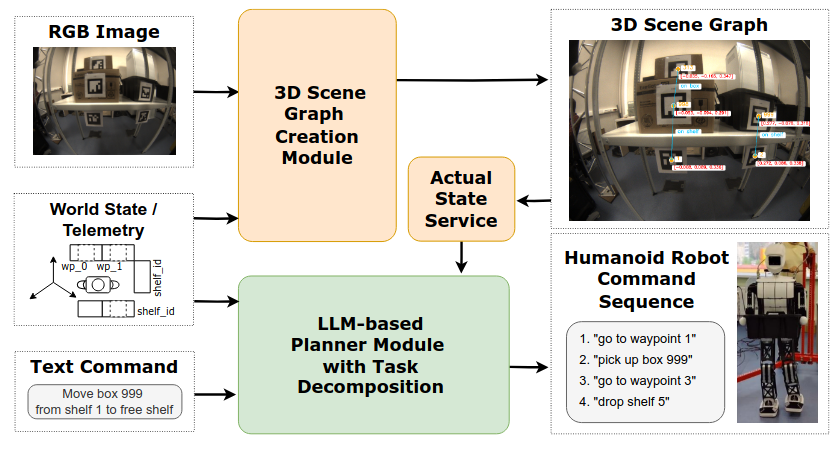

<p align="center">

  <h1 align="center">SG-RAPL: <br>
Scene Graph-Driven Reasoning <br> for Action Planning of Humanoid Robot</h1>
  <p align="center">
    Yudin Dmitry
    ·
    Lazarev Aleksandr
    .
    Bakaeva Eva
    <br>
    Kochetkova Angelika
    ·
    Panov Aleksandr
    ·
    Kovalev Aleksei
  </p>

  <h4 align="center"><a href="https://sashadance.github.io/SG-RAPL.github.io/">Project</a> | <a href="https://github.com/SashaDance/SG-RAPL">Code</a></h4>
  <div align="center"></div>
</p>

<p align="center">

</p>

# Description

This project is an open-source code base for our SG-RAPL project. [The paper is submited to Engineering Applications of Artificial Intelligence](https://www.sciencedirect.com/journal/engineering-applications-of-artificial-intelligence).

# Dataset

SG-RAPL Datset can be found [here](https://drive.google.com/file/d/1yCPMaw1ctYoEcuXvhehXRHbuXYjlrLqX/view?usp=sharing).

# Launch 
This project follows a microservice architecture, microservices communicate with each other with volumes.

To get started clone this repository:
```bash
git clone https://github.com/SashaDance/SG-RAPL.git
```

## Run a service
```bash

docker compose up -d --build
export COMPOSE_FILE=compose.base.yaml:compose.dev.yaml
docker compose up -d --build $SERVICE
```

## Test service


```bash
export COMPOSE_FILE=compose.base.yaml:compose.dev.yaml
docker compose up -d --build $SERVICE
docker compose exec $SERVICE bash -c "poetry run pytest -vv"
```

## Bare requests
To a service by `curl`
```bash
curl --location --request POST 'http://service:8000/invoke' \
    --header 'Content-Type: application/json' \
    --data-raw '{}'
```